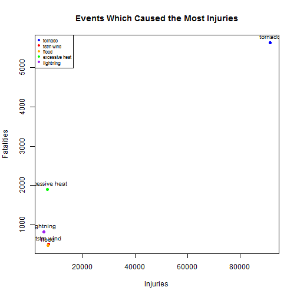

##Synopsis
In this analysis I have analyzed the various damages that have occurred in respect to different types of weather events. There were 898 different types of weather events listed in the data that I analyzed. For each of these events, I calculated the total amount of fatalities, injuries, and property damage. From this calculation I will analyze which event is the most destructive in regards to population health, and property damage.

##Data Processing
The data explores the U.S. National Oceanic and Atmospheric Administration's database. A link to the data from their database is located at the following url:

https://d396qusza40orc.cloudfront.net/repdata%2Fdata%2FStormData.csv.bz2

I used the following code to download the file, and create a data frame to properly read the data in an organized manner. The code will also give a header of the dataset provided by the U.S. National Oceanic and Atmospheric Administration's database.

```r
##Set working directory and download the file
setwd("C:/Users/james/SkyDrive/Data Science/Coursera_Reproducible_Research/Project_2")
setInternet2(TRUE)
file <- download.file("https://d396qusza40orc.cloudfront.net/repdata%2Fdata%2FStormData.csv.bz2" , destfile="./Data/storm.csv.bz2")

##Read the file
storm_df <- read.csv(bzfile("./Data/storm.csv.bz2"))
head(storm_df)
```

```
##   STATE__           BGN_DATE BGN_TIME TIME_ZONE COUNTY COUNTYNAME STATE
## 1       1  4/18/1950 0:00:00     0130       CST     97     MOBILE    AL
## 2       1  4/18/1950 0:00:00     0145       CST      3    BALDWIN    AL
## 3       1  2/20/1951 0:00:00     1600       CST     57    FAYETTE    AL
## 4       1   6/8/1951 0:00:00     0900       CST     89    MADISON    AL
## 5       1 11/15/1951 0:00:00     1500       CST     43    CULLMAN    AL
## 6       1 11/15/1951 0:00:00     2000       CST     77 LAUDERDALE    AL
##    EVTYPE BGN_RANGE BGN_AZI BGN_LOCATI END_DATE END_TIME COUNTY_END
## 1 TORNADO         0                                               0
## 2 TORNADO         0                                               0
## 3 TORNADO         0                                               0
## 4 TORNADO         0                                               0
## 5 TORNADO         0                                               0
## 6 TORNADO         0                                               0
##   COUNTYENDN END_RANGE END_AZI END_LOCATI LENGTH WIDTH F MAG FATALITIES
## 1         NA         0                      14.0   100 3   0          0
## 2         NA         0                       2.0   150 2   0          0
## 3         NA         0                       0.1   123 2   0          0
## 4         NA         0                       0.0   100 2   0          0
## 5         NA         0                       0.0   150 2   0          0
## 6         NA         0                       1.5   177 2   0          0
##   INJURIES PROPDMG PROPDMGEXP CROPDMG CROPDMGEXP WFO STATEOFFIC ZONENAMES
## 1       15    25.0          K       0                                    
## 2        0     2.5          K       0                                    
## 3        2    25.0          K       0                                    
## 4        2     2.5          K       0                                    
## 5        2     2.5          K       0                                    
## 6        6     2.5          K       0                                    
##   LATITUDE LONGITUDE LATITUDE_E LONGITUDE_ REMARKS REFNUM
## 1     3040      8812       3051       8806              1
## 2     3042      8755          0          0              2
## 3     3340      8742          0          0              3
## 4     3458      8626          0          0              4
## 5     3412      8642          0          0              5
## 6     3450      8748          0          0              6
```

The following code creates a data frame from the 'storm_df' dataset to show total fatalities and injuries from each unique event. This data frame will be used to determine the damage on the population for each event.

```r
##Need to create a loop to create 3 different vectors which include information
##for each unique event type (EVTYPE).
#Before starting, make sure to change the values in EVTYPE variable to lowercase
##as there are a lot of repeat values that should be unique, but are not due to case.
storm_df$EVTYPE <- tolower(storm_df$EVTYPE)
type <- vector()  #First vector representing the type of storm
fatalities <- vector()  #Second vector representing the number of fatalites
injuries <- vector()  #Third vector representing the number of injuries
for (i in 1:length(unique(storm_df$EVTYPE))){
  temp_df <- storm_df[storm_df$EVTYPE==unique(storm_df$EVTYPE)[i],]
  type <- append(type, unique(storm_df$EVTYPE)[i])
  fatalities <- append(fatalities, sum(temp_df$FATALITIES))
  injuries <- append(injuries, sum(temp_df$INJURIES))
}

##Create the data frame with the vectors just made
##Then make a new column with the sum of the values from fatalities and injuries
pop_dmg_df <- data.frame(cbind(type, fatalities, injuries))
colnames(pop_dmg_df)[2] <- "fatalities"
colnames(pop_dmg_df)[3] <- "injuries"
pop_dmg_df[,2] <- as.numeric(as.character(pop_dmg_df[,2]))
pop_dmg_df[,3] <- as.numeric(as.character(pop_dmg_df[,3]))
pop_dmg_df <- cbind(pop_dmg_df, "sum_fatal_injury"=pop_dmg_df$fatalities+pop_dmg_df$injuries)
head(pop_dmg_df)
```

```
##                    type fatalities injuries sum_fatal_injury
## 1               tornado       5633    91346            96979
## 2             tstm wind        504     6957             7461
## 3                  hail         15     1361             1376
## 4         freezing rain          7       23               30
## 5                  snow          5       31               36
## 6 ice storm/flash flood          0        2                2
```

The following code creates a data frame from the 'storm_df' dataset to show total property damage from each unique event. This data frame will be used to determine the damage on the properties for each event.

```r
##Need to create a loop to create 2 different vectors which include information
##for each unique event type (EVTYPE).
#Before starting, make sure to change the values in EVTYPE variable to lowercase
##as there are a lot of repeat values that should be unique, but are not due to case.
storm_df$EVTYPE <- tolower(storm_df$EVTYPE)
type <- vector()  #First vector representing the type of storm
property_damage <- vector()  #Second vector representing the property damage
for (i in 1:length(unique(storm_df$EVTYPE))){
  temp_df <- storm_df[storm_df$EVTYPE==unique(storm_df$EVTYPE)[i],]
  type <- append(type, unique(storm_df$EVTYPE)[i])
  property_damage <- append(property_damage, sum(temp_df$PROPDMG))
}

##Create the data frame with the vectors just made
##The datafame should have the unique event and total property damage for that event
prop_dmg_df <- data.frame(cbind(type, property_damage))
colnames(prop_dmg_df)[2] <- "property_damage"
prop_dmg_df[,2] <- as.numeric(as.character(prop_dmg_df[,2]))
head(prop_dmg_df)
```

```
##                    type property_damage
## 1               tornado      3212258.16
## 2             tstm wind      1335995.61
## 3                  hail       688693.38
## 4         freezing rain         2951.70
## 5                  snow         3069.32
## 6 ice storm/flash flood            0.00
```

##Results

The following code produces a data frame and plot which shows the highest number of fatalities (x-axis) caused by the its respective event type. 

From analyzing this graph we can see that tornadoes, excessive heat, and flash flood cause the most fatalities.

```r
##Figure 1 code showing which events caused the most fatalities
##Sort decreasing order for fatalities
fatal_df <- pop_dmg_df[order(pop_dmg_df$fatalities, decreasing=TRUE),]
#Subset this dataframe to get the first five rows to include in plot, then plot
fatal_dfs <- fatal_df[1:5,]
head(fatal_dfs)
```

```
##              type fatalities injuries sum_fatal_injury
## 1         tornado       5633    91346            96979
## 99 excessive heat       1903     6525             8428
## 20    flash flood        978     1777             2755
## 27           heat        937     2100             3037
## 15      lightning        816     5230             6046
```

```r
plot(fatal_dfs$fatalities, fatal_dfs$injuries, main="Events Which Caused the Most Fatalities",
     xlab="Fatalities", ylab="Injuries")
text(fatal_dfs$fatalities, fatal_dfs$injuries, labels=fatal_dfs$type, cex=.8, pos=3)
points(fatal_dfs[1,2], fatal_dfs[1,3], col="blue", pch=19)
points(fatal_dfs[2,2], fatal_dfs[2,3], col="red", pch=19)
points(fatal_dfs[3,2], fatal_dfs[3,3], col="orange", pch=19)
points(fatal_dfs[4,2], fatal_dfs[4,3], col="green", pch=19)
points(fatal_dfs[5,2], fatal_dfs[5,3], col="purple", pch=19)
legend("topleft", legend=fatal_dfs$type, col=c("blue", "red","orange", "green", "purple"),
                           cex=.65, pch=19)
```

 

The following code produces a data frame and plot which shows the highest number of injuries (x-axis) caused by the its respective event type. 

From analyzing this graph we can see that tornadoes, tstm wind, and flood cause the most injuries.

```r
##Figure 2 Code showing which events caused the most injuries
##Sort decreasing order for injuries
injury_df <- pop_dmg_df[order(pop_dmg_df$injuries, decreasing=TRUE),]
#Subset this dataframe to get the first five rows to include in plot, then plot
injury_dfs <- injury_df[1:5,]
head(injury_dfs)
```

```
##              type fatalities injuries sum_fatal_injury
## 1         tornado       5633    91346            96979
## 2       tstm wind        504     6957             7461
## 36          flood        470     6789             7259
## 99 excessive heat       1903     6525             8428
## 15      lightning        816     5230             6046
```

```r
plot(injury_dfs$injuries, injury_dfs$fatalities, main="Events Which Caused the Most Injuries",
     xlab="Injuries", ylab="Fatalities")
text(injury_dfs$injuries, injury_dfs$fatalities, labels=injury_dfs$type, cex=.8, pos=3)
points(injury_dfs[1,3], fatal_dfs[1,2], col="blue", pch=19)
points(injury_dfs[2,3], injury_dfs[2,2], col="red", pch=19)
points(injury_dfs[3,3], injury_dfs[3,2], col="orange", pch=19)
points(injury_dfs[4,3], injury_dfs[4,2], col="green", pch=19)
points(injury_dfs[5,3], injury_dfs[5,2], col="purple", pch=19)
legend("topleft", legend=injury_dfs$type, col=c("blue", "red","orange", "green", "purple"),
       cex=.65, pch=19)
```

 

The following code produces a data frame and plot which shows the greatest property damage (y-axis) caused by the its respective event type (x-axis). 

From analyzing this graph we can see that tornadoes, flash flood, and tstm wind, cause the most property damage.

```r
##Figure 3 Code showing which events caused the most property damage
##Sort decreasing order for property damage
prop_df <- prop_dmg_df[order(prop_dmg_df$property_damage, decreasing=TRUE),]
#Subset this dataframe to get the first five rows to include in plot, then plot
prop_dfs <- prop_df[1:5,]
head(prop_dfs)
```

```
##                 type property_damage
## 1            tornado       3212258.2
## 20       flash flood       1420124.6
## 2          tstm wind       1335995.6
## 36             flood        899938.5
## 16 thunderstorm wind        876844.2
```

```r
barplot(prop_dfs$property_damage, names.arg=prop_dfs$type, border=TRUE, xlab="Event", ylab="Amount of Property Damage",
        main="Property Damage for Most Destructive Events", col=c("blue","red","green","orange","purple"),
        cex.names=.6)
```

 
