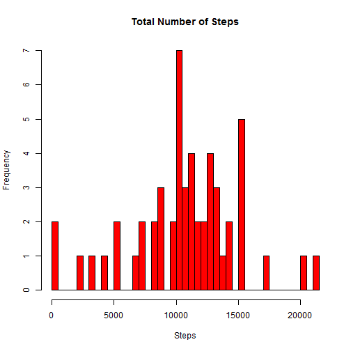
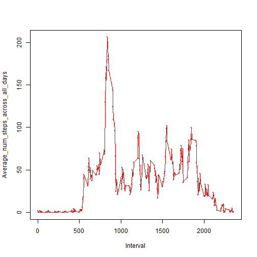
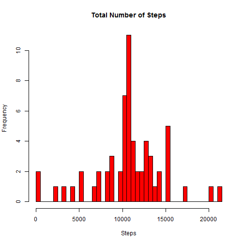
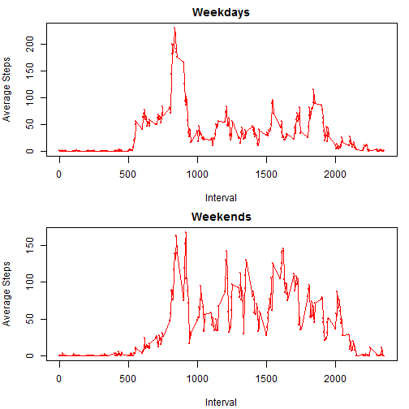

Loading and Preprocesing the Data
---

```r
##Set the working directory on local cpu
setwd("C:/Users/james/SkyDrive/Data Science/Coursera_Reproducible_Research/Project_1")
##Download the file and manually extract the .csv file
#download.file("https://d396qusza40orc.cloudfront.net/repdata%2Fdata%2Factivity.zip", destfile="activity.zip")

##Read the .csv file
original_data <- read.csv("activity.csv")
original_data <- data.frame(original_data)
head(original_data) #The original dataset has many NA values
```

```
##   steps       date interval
## 1    NA 2012-10-01        0
## 2    NA 2012-10-01        5
## 3    NA 2012-10-01       10
## 4    NA 2012-10-01       15
## 5    NA 2012-10-01       20
## 6    NA 2012-10-01       25
```

```r
##Clean data frame by removing any rows with NA values 
data <- data.frame(original_data)
data <- data[which(data$steps >= 0),]
head(data) #The dataset is now cleaned with no NA values
```

```
##     steps       date interval
## 289     0 2012-10-02        0
## 290     0 2012-10-02        5
## 291     0 2012-10-02       10
## 292     0 2012-10-02       15
## 293     0 2012-10-02       20
## 294     0 2012-10-02       25
```

What is the mean total number of steps taken per day
---

```r
##Calculate total number of steps taken per day
unique_data_date <- unique(data$date)
sum_steps <- vector()
steps <- vector()
for (i in 1:length(unique_data_date)){
  data2 <- data[data$date==unique_data_date[i],]
  sum_steps <- sum(data2$steps)
  steps <- append(steps, sum_steps)
}
steps_data <- data.frame(steps, unique_data_date)
colnames(steps_data) <- c("Steps", "Date")
head(steps_data) #Dataset shows total amount of steps for each day 
```

```
##   Steps       Date
## 1   126 2012-10-02
## 2 11352 2012-10-03
## 3 12116 2012-10-04
## 4 13294 2012-10-05
## 5 15420 2012-10-06
## 6 11015 2012-10-07
```

```r
##Create histogram for the total number of steps
hist(steps_data$Steps, col="red", breaks=53, xlab="Steps", main="Total Number of Steps")
```

 

```r
##Calculate and report the mean and median of the total number of steps taken per day
Mean <- vector()
Median <- vector()
for (i in 1:length(unique_data_date)){
  temp_data <- data[data$date==unique_data_date[i],]
  daily_mean <- steps_data$Steps[i]/dim(temp_data)[1]
  Mean <- append(Mean, daily_mean)
}
steps_data <- cbind(steps_data, Mean)
for (i in 1:length(unique_data_date)){
  temp_data <- data[data$date==unique_data_date[i],]
  Median <- append(Median, median(temp_data[,1]))
}
steps_data <- cbind(steps_data, Median) 
head(steps_data) #This dataset now shows total amount of steps for each day and the mean & median number of steps for each interval that day
```

```
##   Steps       Date     Mean Median
## 1   126 2012-10-02  0.43750      0
## 2 11352 2012-10-03 39.41667      0
## 3 12116 2012-10-04 42.06944      0
## 4 13294 2012-10-05 46.15972      0
## 5 15420 2012-10-06 53.54167      0
## 6 11015 2012-10-07 38.24653      0
```

What is the average daily activity pattern?
---

```r
##Make a time series plot (i.e. type = "l") of the 5-minute interval (x-axis) and the average number of steps taken, averaged across all days (y-axis)
##Which 5-minute interval, on average across all the days in the dataset, contains the maximum number of steps?
unique_data_interval <- unique(data$interval)
max_steps_interval <- vector()
for (i in 1:length(unique_data_interval)){
  temp_data <- data[data$interval==unique_data_interval[i],]
  max_steps_interval <- append(max_steps_interval, sum(temp_data$steps))
}
max_interval <- data.frame(cbind(max_steps_interval, unique_data_interval))
colnames(max_interval) <- c("steps", "interval") 
final_max_interval <- max_interval[max_interval$steps==max(max_interval[,1]),] 
final_max_interval #This gives the maximum number of steps and its respective interval 
```

```
##     steps interval
## 104 10927      835
```

```r
final_avg_interval <- data.frame(cbind(max_interval, "average_num_steps_across_all_days" = (max_interval$steps/53))) #This gives the average number of steps taken, averaged across all days
#This plots the average number of steps taken, averaged across all days
plot(final_avg_interval$interval, final_avg_interval$average_num_steps_across_all_days, cex=.2, col="red", xlab="Interval", ylab="Average_num_steps_across_all_days") 
lines(final_avg_interval$interval, final_avg_interval$average_num_steps_across_all_days, col="red")
```

 

Inputting missing values
---

```r
##Calculate and report the total number of missing values in the dataset (i.e. the total number of rows with NAs)
not_avail <- is.na(original_data)
not_avail <- data.frame(not_avail)
library(plyr)
count(not_avail, vars="steps") #Where TRUE is equal to 'NA' values
```

```
##   steps  freq
## 1 FALSE 15264
## 2  TRUE  2304
```
There are 2304 values in the step column with "NA" values

```r
#Fill in all of the missing values in the original dataset using the mean number of steps across all days for each interval 
orig_data_mod <- original_data
len_orig_data <- dim(original_data)[1] #Number of rows in original data
orig_data_mod[is.na(orig_data_mod)] <- "replace_me" #Change NA values in original dataset so that you can use if statement in for loop. (if statement can't read NA values)
for (i in 1:len_orig_data){  #For loop to replace all missing values with the mean number of steps across all days for that interval 
  temp_1 <- orig_data_mod$interval[i]
  if (orig_data_mod$steps[i]=="replace_me"){
    for (x in 1:288){  #288 is the length of the unique intervals counted
      if (temp_1==final_avg_interval$interval[x]){
        orig_data_mod$steps[i] <- final_avg_interval$average_num_steps_across_all_days[x]
}}}}
orig_data_mod[,1] <- as.numeric(as.character(orig_data_mod[,1]))
orig_data_mod[,1] <- round(orig_data_mod[,1], 3) ##Round the steps to three decimal places
head(orig_data_mod) #Modified original dataset so all NA values are replaced
```

```
##   steps       date interval
## 1 1.717 2012-10-01        0
## 2 0.340 2012-10-01        5
## 3 0.132 2012-10-01       10
## 4 0.151 2012-10-01       15
## 5 0.075 2012-10-01       20
## 6 2.094 2012-10-01       25
```

Are there differences in activity patterns between weekdays and weekends?
---

```r
##Calculate the total number of steps taken each day using the new dataset (the dataset which replaced the NAs)
unique_data_date2 <- unique(orig_data_mod$date) 
sum_steps2 <- vector()
steps2 <- vector()
for (i in 1:length(unique_data_date2)){
  data3 <- orig_data_mod[orig_data_mod$date==unique_data_date2[i],]
  sum_steps2 <- sum(data3$steps)
  steps2 <- append(steps2, sum_steps2)
}
steps_data2 <- data.frame(steps2, unique_data_date2)
colnames(steps_data2) <- c("Steps", "Date")
head(steps_data2) #This dataset includes the total number of steps for each date with the NA values replaced
```

```
##      Steps       Date
## 1 10766.19 2012-10-01
## 2   126.00 2012-10-02
## 3 11352.00 2012-10-03
## 4 12116.00 2012-10-04
## 5 13294.00 2012-10-05
## 6 15420.00 2012-10-06
```

```r
#Calculate and report the mean and median total number of steps taken per day using the new dataset (the dataset which replaced the NAs)
Mean2 <- vector()
Median2 <- vector()
for (i in 1:length(unique_data_date2)){
  temp_data <- orig_data_mod[orig_data_mod$date==unique_data_date2[i],]
  daily_mean2 <- steps_data2$Steps[i]/dim(temp_data)[1]
  Mean2 <- append(Mean2, daily_mean2)
}
steps_data2 <- cbind(steps_data2, Mean2)
for (i in 1:length(unique_data_date2)){
  temp_data <- orig_data_mod[orig_data_mod$date==unique_data_date2[i],]
  Median2 <- append(Median2, median(temp_data[,1]))
}
steps_data2 <- cbind(steps_data2, Median2)
colnames(steps_data2)[c(3,4)] <- c("Mean", "Median")
head(steps_data2) #This dataset includes the mean and median for each date with the NA values replaced
```

```
##      Steps       Date     Mean Median
## 1 10766.19 2012-10-01 37.38259 34.113
## 2   126.00 2012-10-02  0.43750  0.000
## 3 11352.00 2012-10-03 39.41667  0.000
## 4 12116.00 2012-10-04 42.06944  0.000
## 5 13294.00 2012-10-05 46.15972  0.000
## 6 15420.00 2012-10-06 53.54167  0.000
```

```r
##Create a histogram for the total number of steps
hist(steps_data2$Steps, col="red", breaks=61, xlab="Steps", main="Total Number of Steps")
```

 

```r
##Create a new factor variable in the dataset with two levels - "weekday" and "weekend" indicating whether a given date is a weekday or weekend day.
orig_data_mod[,2] <- as.Date(as.character(orig_data_mod[,2])) 
Weekday <- weekdays(orig_data_mod[,2]) #Convert the dates to the given day
orig_data_mod <- cbind(orig_data_mod, Weekday)
Day_Type <- vector()
for (i in 1:(dim(orig_data_mod)[1])){
  if (orig_data_mod[i,4]=="Monday"|orig_data_mod[i,4]=="Tuesday"|orig_data_mod[i,4]=="Wednesday"|orig_data_mod[i,4]=="Thursday"|orig_data_mod[i,4]=="Friday"){
  Day_Type <- append(Day_Type, "Weekday")
}
  else{
    Day_Type <- append(Day_Type, "Weekend")
  }
}
final_orig_data_mod <- cbind(orig_data_mod, Day_Type)

#Create a dataset with only weekday values steps averaged for each interval
weekday <- final_orig_data_mod[final_orig_data_mod$Day_Type=="Weekday",] #subset 'final_orig_data_mod' dataset to only include rows that are weekdays
unq_wday_interval <- unique(weekday$interval)
avg_steps_weekday <- vector()
interval_weekday <- vector()
for (i in 1:(length(unq_wday_interval))){
  temp_data <- weekday[weekday$interval==unq_wday_interval[i],]
  sum_wday <- sum(as.numeric(temp_data$steps))/nrow(temp_data)
  avg_steps_weekday <- append(avg_steps_weekday, sum_wday)
  interval_weekday <- append(interval_weekday, unq_wday_interval[i]) 
}
final_weekday <- data.frame(cbind(avg_steps_weekday, interval_weekday))
final_weekday[,1] <- round(final_weekday$avg_steps_weekday, 3)
head(final_weekday) #Dataset with only weekday values steps averaged for each interval
```

```
##   avg_steps_weekday interval_weekday
## 1             2.251                0
## 2             0.445                5
## 3             0.173               10
## 4             0.198               15
## 5             0.099               20
## 6             1.590               25
```

```r
#Create a dataset with only weekend values steps averaged for each interval
weekend <- final_orig_data_mod[final_orig_data_mod$Day_Type=="Weekend",] #subset 'final_orig_data_mod' dataset to only include rows that are weekdends
unq_wend_interval <- unique(weekend$interval)
avg_steps_weekend <- vector()
interval_weekend <- vector()
for (i in 1:(length(unq_wend_interval))){
  temp_data <- weekend[weekend$interval==unq_wend_interval[i],]
  sum_wend <- sum(as.numeric(temp_data$steps))/nrow(temp_data)
  avg_steps_weekend <- append(avg_steps_weekend, sum_wend)
  interval_weekend <- append(interval_weekend, unq_wend_interval[i]) 
}
final_weekend <- data.frame(cbind(avg_steps_weekend, interval_weekend))
final_weekend[,1] <- round(final_weekend$avg_steps_weekend, 3)
head(final_weekend) #Dataset with only weekend values steps averaged for each interval
```

```
##   avg_steps_weekend interval_weekend
## 1             0.215                0
## 2             0.042                5
## 3             0.016               10
## 4             0.019               15
## 5             0.009               20
## 6             3.512               25
```

```r
#Make a panel plot containing a time series plot of the 5-minute interval (x-axis) and the average number of steps taken, averaged across all weekday days or weekend days (y-axis)
par(mfrow=c(2,1), mar=c(4.1,4,2,1))
plot(final_weekday$interval_weekday, final_weekday$avg_steps_weekday, cex=.2, col="red", xlab="Interval", ylab="Average Steps", main="Weekdays") #This plots the average number of steps taken for each interval, averaged across all weekdays
lines(final_weekday$interval_weekday, final_weekday$avg_steps_weekday, col="red")
plot(final_weekend$interval_weekend, final_weekend$avg_steps_weekend, cex=.2, col="red", xlab="Interval", ylab="Average Steps", main="Weekends") #This plots the average number of steps taken for each interval, averaged across all weekends
lines(final_weekend$interval_weekend, final_weekend$avg_steps_weekend, col="red")
```

 


